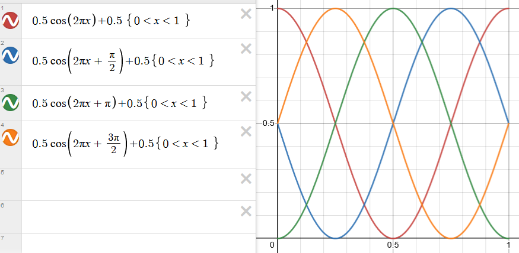
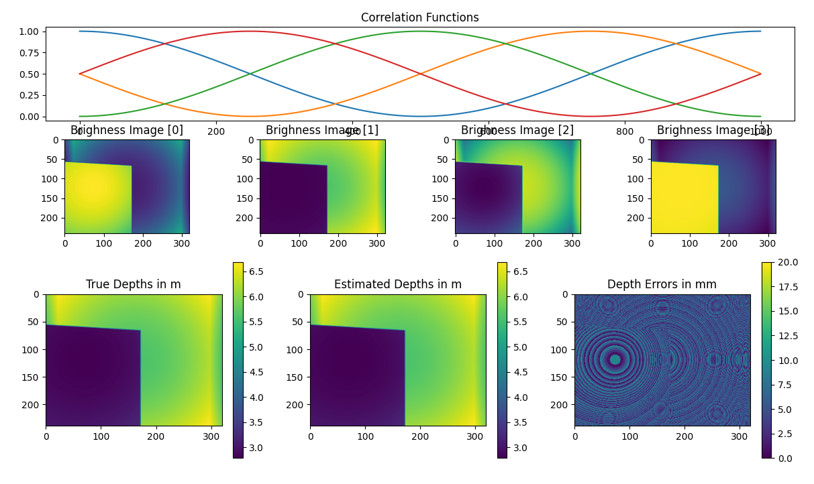
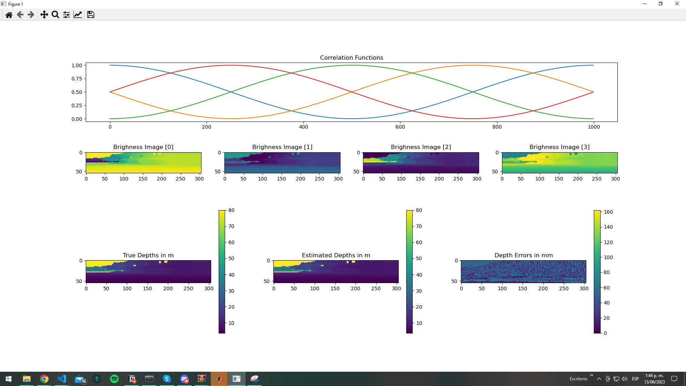
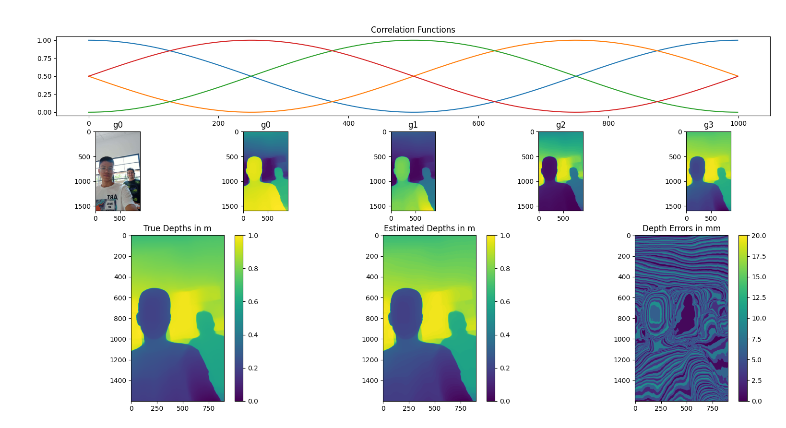

# notas 2022-06-14

## codigo felipe: [repo](https://github.com/felipegb94/ToFSim)


globalmente se define `n` como el numero de puntos en la funcion sinosoidal y `k` como el numeros de funciones a generar

Posteriormente se usa la funcion `generate_m_phase_sinusoid` para generar las funciones sinosoidales con los desplazamientos de fase

### generate_m_phase_sinusoid

```python
def generate_m_phase_sinusoid(n, m_phase=3, freqs=[1]):
	
	n_freqs = len(freqs)
	k = m_phase*n_freqs
	corrfs = np.zeros((n, k))

	phase_step = 2*np.pi / m_phase
	domain = np.arange(0, n) / n  # 0 to 1
	
	for i in range(n_freqs):
		curr_f = freqs[i]
		for j in range(m_phase):
			curr_k = (i*m_phase) + j
			curr_phi = (j*phase_step) / curr_f

			print("Curr F = {}, Curr K = {}, Curr Phi = {}".format(curr_f, curr_k, curr_phi))
			
			curr_sinusoid = 0.5 * np.cos( (2*np.pi*curr_f*domain) + curr_phi ) + 0.5 
			corrfs[:, curr_k] = curr_sinusoid
	
	return corrfs
```

Esta funcion recibe el numero de puntos `n`, el numero de fases distintas `m_phase` y el numero de frecuencias distintas `freqs`, posteriormente genera una matriz `corrfs` donde se guardaramn las onda generada, con tamaño $n * k$ donde `k` es el numero de funciones a generar

luego se cacula el phase_step, el cual es el desplazamiento de fase entre cada funcion sinosoidal

$$
phase  \\_ step = \frac{2\pi}{m\\_phase}
$$

se generan n puntos entre [0 1], los cuales seran el dominio de la funcion sinosoidal

Para la generacion de las ondas se utilizan dos for's encadenados, el primero que iterara sobre las frecuencias y el segundo sobre las fases. Se asumira que se generan ondas de frecuencias iguales por tanto se ignorara el primer for


```python
    for j in range(m_phase):
        curr_phi = (j*phase_step) 
        
        curr_sinusoid = 0.5 * np.cos( (2*np.pi*1*domain) + curr_phi ) + 0.5 
        
        corrfs[:, j] = curr_sinusoid
```

primero se calcula la fase actual a generar, con la formula

$$
curr\\_phi = phase\\_step * j
$$

de tal forma que para el caso de 4 fases distintas se generaran las siguientes fases

phase_step = $\frac{2\pi}{4} = \frac{\pi}{2}$

- j = 0 => curr_phi = 0 * $\frac{\pi}{2}$ = 0
- j = 1 => curr_phi = 1 * $\frac{\pi}{2}$ = $\frac{\pi}{2}$
- j = 2 => curr_phi = 2 * $\frac{\pi}{2}$ = $\pi$
- j = 3 => curr_phi = 3 * $\frac{\pi}{2}$ = $\frac{3\pi}{2}$

obteniendo 

$$
curr\\_phi = \{0, \frac{\pi}{2}, \pi, \frac{3\pi}{2}\}
$$

que corresponde a las fases de g0, g1, g2, g3

ya con la fase calculada, se procede a generar los puntos de la funcion asi:

$$
curr\\_sinusoid = 0.5 * cos( 2\pi*x + curr\\_phi ) + 0.5
$$

se establece que la amplitud de la funcion es 0.5 y el desplazamiento vertical es 0.5, de tal forma que la funcion sinosoidal generada se encuentra entre [0 1]

por ultimo se guarda la funcion generada en la matriz `corrfs` en la columna `j`

*funciones generadas vistas graficamente*


### datos

se carga un mapa de profundidad, donde el valor de cada pixel correspodne a la profundidad

### calculo de tof

se genera una matriz tridimensional con las siguientes dimensiones

$$
b \in \mathbb{R}^{m \times n \times k}
$$

es necesario definir la resolucion de la profundiad, la cual se define como

$$
depth\\_res = \frac{max\\_depth}{n}
$$

esto con el fin de discretizar la profundidad en `n` bins, de tal forma que cada bin corresponde a un valor de profundidad

posteriormente se itera sobre cada punto de la matriz `b` y se calcula el tiempo de vuelo para cada punto

```python
for i in range(nr):
    for j in range(nc):
        curr_depth = depth_img[i,j]
        curr_depth_bin = np.floor(curr_depth / depth_res)
        b_img[i,j,:] = corrfs[int(curr_depth_bin), :]
```

se selecciona cada profundidad, se calcula el bin al que corresponde y se selecciona el valor en la funcion sinosoidal correspondiente a ese bin para cada g


### calculo profundidad

para calcular la profundiad se normalizar la matriz  `b` y la matriz que contiene las funciones sinosoidales  `corrfs`

luego se multiplican las dos matrices, se va a asumir el caso de una sola frecuencia, 4 fases y un tamaño de imagen de 240x320

$$
\begin{align*}
corrfs \in \mathbb{R}^{1000 \times 4} \\
b \in \mathbb{R}^{240 \times 320 \times 4}
\end{align*}
$$

se agrega una dimension a la matriz  `b` para que quede de la siguiente forma

$$
b \in \mathbb{R}^{240 \times 320 \times 4 \times 1}
$$

de esta forma se puede hacer la multiplicacion matricial, ya que:

>"For inputs with more than 2 dimensions, we treat the last two dimensions as being the dimensions of the matrices to multiply, and ‘broadcast’ across the other dimensions. "

la matriz resultante de la multiplicacion tendra las dimensiones

$$
\begin{align*}
b\\_norm \in \mathbb{R}^{240 \times 320 \times 1000 \times 1} \\
squeeze(b\\_norm) \in \mathbb{R}^{240 \times 320 \times 1000}
\end{align*}
$$

de esta matriz resultante obtenemos el indice del valor maximo para cada pixel, el cual corresponde al bin con mayor probabilidad, y se multiplica por la resolucion de profundidad para obtener la profundidad, todo esto se hace en la funcion `zncc_depth_est`


```python
est_depth_img = zncc_depth_est(b_img, corrfs) * depth_res
```

esa seria la profundidad estimada, la cual se compara con la profundidad real para obtener el error


**NOTE:**

resaltar que este metodo una usa la formula de arctan para calcular la fase y a partir de la fase calcular la profundidad en cada punto, mas se usa el metodo arriba descrito, se intento calcularlo con el metodo de la arctan pero los resultados no fueron satisfactorios, en todo caso el codigo seria algo asi:

```python
def calculate_depths(b_img):
	angle = np.arctan( (b_img[:,:,1] - b_img[:,:,3]) / (b_img[:,:,0] - b_img[:,:,2]) ) 

	c = 3e8
	depth = (c/2) * ( angle / (2 * np.pi * 3e8/(10*2) ) )

	return depth
```

Como en este metodo no se define nunca la frecencia pero esta puede ser calculada ya que el max_depth que corresponde a la longitud de onda maxima, se puede calcular la frecuencia con la formula

$$
f = \frac{c}{\lambda}
$$


### error

se calcula el erro absoluto multiplicado por 1000 para obtener el error en milimetros

```python
error = np.abs(est_depth_img - depth_img) * 1000
```


### ejemplo de ejecucion (default)




### ejemplo de ejecucion (dataset)

se probo con una imagen de un dataset de internet, a continuacion se muestra el resultado:




### ejemplo de ejecucion (custom)

se probo con una imagen tomada propia rgb, a la cual se le estimo la profundidad con un modelo del estado del arte y el mapa generado se paso como depth para calcular los g0,g1,g2 y g3




