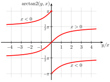
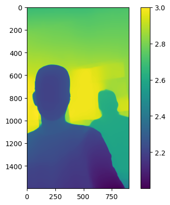
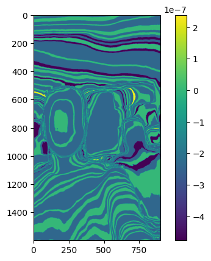
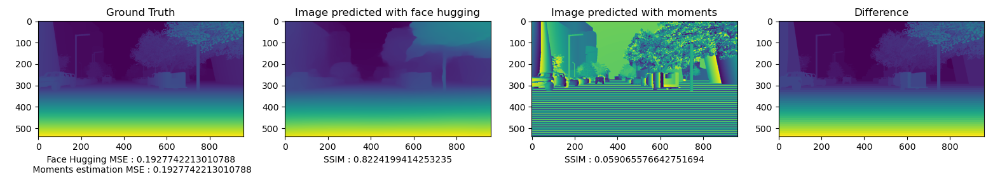

# notas 2023-06-21

se deja el codigo de felipe por si acaso: [repo](https://github.com/felipegb94/ToFSim)

## Cuestiones acerca del codigo de felipe

- no se define la frecuencia de la onda modulada, en cambio se define el `max_depth` (puede ser equivalente)

- se utiliza toda la longitud de onda para calculas los desfases, cuando solo se deberia utilizar `λ/2`

- hace un desplazamiento en `y` de la onda modulada, y no explica el por que

- el pipeline para calcular el depth no esta documentada y no es el mismo que se utiliza en el SOTA

- para obtener los valores de los g's, los obtiene evaluando la onda modulada en el punto en el eje x que corresponde a la profundidad, en vez de el punto que corresponde al desfase

**por estar razones se decidio construir una simulacion propia, usando como prior algunas operaciones del codigo de felipe**

## Simulacion propia

Para realizar la simulacion se definiran las siguienes ecuaciones como base para los calculos posteriores:

$$
\begin{align}

phase = \frac{2 * d}{λ} * 2 \pi \\

\end{align}
$$

esta ecuacion se deriva de:

$$
\begin{align}

d = \frac{c}{2} * \frac{θ}{2 \pi f} \\
d = \frac{c}{2} * \frac{θ}{2 \pi} * \frac{λ}{c}

\end{align}

$$

con esto podemos calcular la fase para cada pixel en la imagen a partir de la profundidad con la ecuación (1)

en la simulación se define la `frecuencia` en MegaHertz

con la frecuencia se pueden encontrar los valores de `wavelength`, `max_depth`, además definimos la amplitud `A`

Posteriormente, con la matriz de fases, se calcula g0,g1,g2 y g3

$$

g_{0} = 0, g_{1} = \frac{pi}{2}, g_{2} = \pi, g_{3} = \frac{2 \pi}{3}

$$

estos son cada uno de los desfases, esto se convierte en la funcion sinosoidal desplazada, evaluada en el desfase:

$$

g_{0} = \cos(θ),g_2 = - sin(θ),g_3 = -\cos(θ),g_4 = sin(θ)

$$

asi se obtiene las 4 matrices de g's y se puede aplicar la formula de arctan asi:

$$
\begin{align*}

phase\\_estimated = arctan(\frac{g_{3} - g_{1}}{g_{0} - g_{2}})

\end{align*}
$$

aunque, es necesario especificar que se debe usar la funcion `arctan2` para evitar errores de calculo, ya que esta funcion toma en cuenta el cuadrante en el que se encuentra el punto

esta funcion recibe dos argumentos y retorna el angulo en radianes

$$

phase\\_estimated = arctan2(g_{3} - g_{1},g_{0} - g_{2})

$$

con la fase estimada calculada, se puede calcular la profundidad con la ecuacion (2)

A continuacion se muestran algunos de los resultados obtenidos, para la estimacion de profundidad en una imagen que se encuentra en el rango de 2 - 3 metros

y el error esta dado por:

el error se encuentra en magnitudes muy pequeñas, por lo que se puede decir que la simulacion es correcta.

Se probo tambien con un dataset foraneo:

Nota:

nuestra simulacion no genera como tal 4 ondas y de esaas ondas saca los g's (asi es como se hace en el codigo de felipe), mas creemos que se puede adaptar y parece trivial adaptarlo.