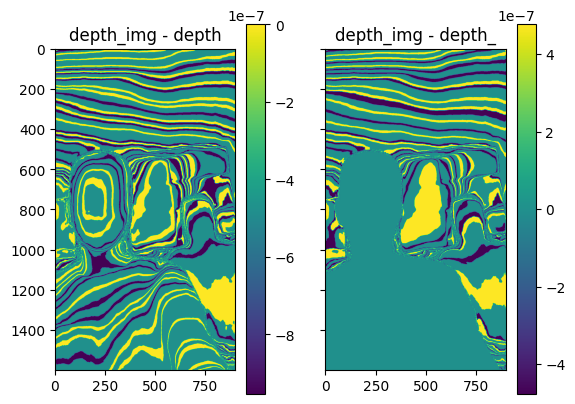
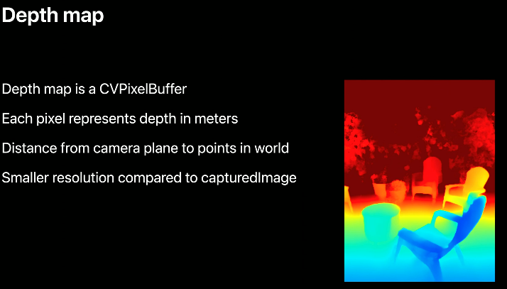

# notas 2023-07-05

se deja el codigo de felipe por si acaso: [repo](https://github.com/felipegb94/ToFSim)

## actualizaciones sobre el codigo anterior

- la simulacion pasada necesitaba calcular las fases para cada pixel a partir de la profundidad, ahora, esto no es necesario.

- se estima la cuadratura a partir de la profundidad de cada pixel

- es necesario definir la frecuencia y amplitud de la señal de la camara

- se creo la clase Camera, que contiene los parametros de la camara, y la funcion de cuadratura para calcular el depth

sin embargo, hay que remarcar en los siguientes aspectos:

Para poder hacer los respectivos calculos de los g's, lo que se hace es que se generan ondas con el siguiente coeficiente B:

$$
B = \frac{2\pi}{\lambda}
$$

donde B se encuentra en la ecuacion de la onda:


este coeficiente se implementa para calcular cada una de las cuadraturas, quedando asi:

$$
g_{i} = A \cos(B * depth + phi_{i})
$$

$$
phi \in \{0, \frac{\pi}{2}, \pi, \frac{3\pi}{2}\}
$$

Luego de obtener todos los g's, se calcula la cuadratura con la formula de arctan2 ya conocida.

pero ahi surge un __**problema**__:
arctan2 devuelve angulos en el intervalo [0,pi]

y la formula para calcular el depth que esta dada por:

$$
d = \frac{c}{2} * \frac{θ}{2 \pi } * \frac{1}{f} \\
$$

especificamente debemos enfocarnos en el segundo termino que es $$\frac{θ}{2 \pi }$$

este terminio espera un angulo en el intervalo [0,2pi], pero con el arctan2 hemos obtenido un angulo en el intervalo [0,pi]

por lo tanto, debemos hacer una conversion de angulos, para que el angulo que se le pase a la formula de depth este en el intervalo [0,2pi], para esto se multiplica el angulo por 2, quedando asi:

$$
θ = 2 * arctan2()
$$

con esto, se obtiene el depth, y se puede calcular el error con respecto al depth real

ahora, existe otro metodo para calcular el depth dado una fase, y es el siguiente:

$$
depth = \frac{phase}{B}
$$

$$
depth = \frac{phase}{\frac{2\pi}{\lambda}}
$$

Si analizamos esta ecuacion notamos que cuando la phase es pi, el depth es $\lambda/2$, que coincide justamente con el max_depth.

Por tanto con este enfoque no es necesario ajustar el intervalo del resultado obtenido con arctan2, ya que el depth obtenido con esta ecuacion siempre estara en el intervalo [0,max_depth]

con los dos enfoques funciona para cualquier depth que se encuentre en el rango de [0,max_depth]

## resultados

A continuacion se muestran los errores para los dos enfoques, no se muestran resultados ya que son muy parecidos:



la imagen de la izquierda corresponde al primer enfoque y la de la derecha al segundo enfoque usando el valor de B.

asi mismo a continuacion se muestran los valores minimos y maximos de los depths estimados para cada uno de los enfoques:


```python
            max    min
approach1 = 7.0 6.0000005
approach2 = 6.9999995 6.0
```

en los dos enfoques notamos un sesgo de 0.0000005, solo que en el que segundo el sesgo es hacia la cola inferior y por tanto el error es menor en esta imagen especifica.


## como obtener rgbd en el ipad

Hay varios enfoques, el primero seria construir uno propio usando la api de ios, arkit. El segundo seria usar una aplicacion que ya este hecha, como por ejemplo 

### Primer enfoque:

apple tiene una api llamada arkit, que permite obtener la profundidad de la escena, aqui presentan la api

https://developer.apple.com/videos/play/wwdc2020/10611/?time=1114%29,



api:
https://developer.apple.com/documentation/arkit/arframe/3566299-scenedepth


foro de discusion:
https://developer.apple.com/forums/thread/674623

un tutorial que lo usa:
https://developer.apple.com/documentation/arkit/arkit_in_ios/environmental_analysis/displaying_a_point_cloud_using_scene_depth

### Segundo enfoque:

a continuacion dejo el link de apps interesantes:

- https://apps.apple.com/us/app/id1419913995

- https://apps.apple.com/us/app/sitescape-lidar-3d-scanner/id1524700432

- https://apps.apple.com/us/app/pix4dcatch-3d-scanner/id1511483044

o usar la de paga