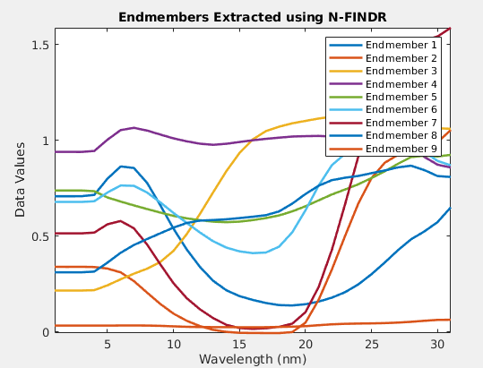
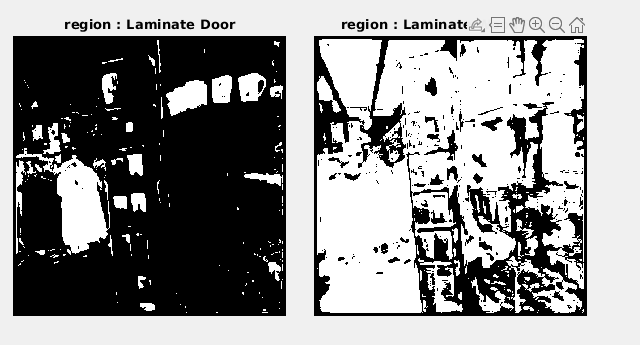

# 2023-08-10

Se intento seguir la siguiente estructura para segmentar los materiales:

1. Estimar los endmembers de la imagen hiperespectral
2. hacer match de los endmembers con alguna de las firmas en spectraldb
3. Asignar un endmember a cada material
4. Encontra los pixeles de la imagen hiperspectral correspondientes a cada endmember
5. Asignar la etiqueta del material encontrada

endmembers:

la imagen:

----

tambien se tenia otras opciones para el pipeline :D

- pasarla por una red de segmentacion y luego hacer busqeuda simple de diccionario

- asignar todos los materiales como los endmembers de la imagen hiperspectral y optimizar las abundancias con la l2