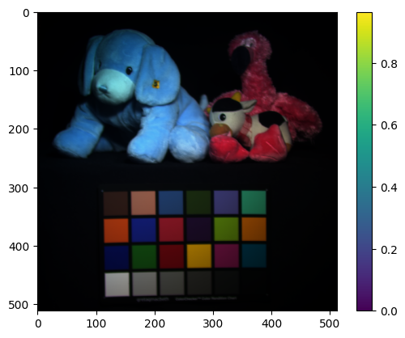
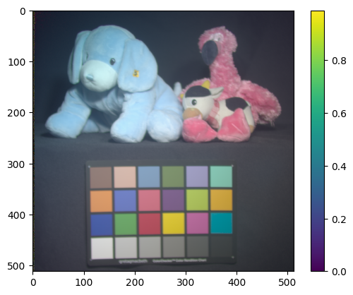
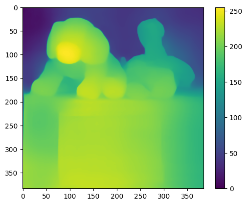

# notas 2023-07-19

Se ha seguido el siguiente pipeline

dataset de imagenes espectrales => transformacion a rgb => generacion de depth map => asociacion de depth map y espectral


## dataset de imagenes espectrales

Se ha usado el dataset [CAVE](http://www.cs.columbia.edu/CAVE/databases/multispectral/)

El dataset contiene 32 imagenes espectrales de 31 bandas, y 32 imagenes RGB de referencia en rgb, sin embargo, esas de referencia no se van a usar. El rango espectral de las imagenes es de 400nm a 700nm, con un paso de 10nm.

talvez, este no sea el dataset mas apropiado, debido a que no son escenas abiertas, si no escenas controladas en la que los objetos tienen una posicion cercana.

## spectral to rgb

Para hacer la transformacion de las imagenes espectrales a rgb, se ha usado la funcion spec2rgb del repositorio del grupo https://github.com/hdspgroup/spec2rgb/blob/main/spec2rgb.py

la funcion recibe como parametros la imagen espectral y el sistemas de color que para el caso del dataset CAVE es sRGB

a continuacion se muestra el resultado obtenido al aplicar la funcion a la imagen stuffed_toys:



sin embargo, el resultado no es el esperado, ya que la imagen resultante no se parece a la imagen de referencia, la imagen obtenida es demasiado oscura. Para resolver esto se ha hecho un clip entre 0 y 1, y se ha elevado a una potencia de 0.3 para aclarar la imagen, y se ha obtenido el siguiente resultado:



esta imagen se parece mas a la imagen de referencia y a partir de esta imagen se ha generado el depth map

## depth map generation

A continuacion se muestra el link usado en las simulaciones anteriores para general el depth map a partir de una imagen RGB:

=> https://huggingface.co/spaces/nielsr/dpt-depth-estimation


la generacion de los depth maps no es inmediata, y se tarda aproximadamente 6s por cada imagen.

El modelo usado es en especifico [dpt-large](https://huggingface.co/Intel/dpt-large) pre-entrenado en dpt-large


https://huggingface.co/docs/transformers/main/en/main_classes/output#transformers.modeling_outputs.DepthEstimatorOutput

por alguna razon cuando se ejecuta usando la api de transformers, la escala de los depth estimados varia, y devuelve valores entre 0 y 30, hay una issue que trata acerca del tema:

https://github.com/isl-org/DPT/issues/58

y es por que la salida del model debe ser post-procesada para obtener el depth 

para el proceso del escalado debe aplicarse lo siguiente:

```python
depth_min = depth.min()
depth_max = depth.max()

max_val = (2 ** (8)) - 1

out = max_val * (depth - depth_min) / (depth_max - depth_min)
```

esto nos da una imagen entre 0 y 255 para el depth



notese la escala de la imagen y las intesidades, se observa que los valores mas altos corresponden a las profundidades mas cercanas y los valores mas bajos corresponden a los valores mas lejanos, por lo que se ha hecho un flip de la imagen para que los valores mas altos correspondan a las profundidades mas lejanas y los valores mas bajos correspondan a las profundidades mas cercanas


```python
out =  ( 255-out ) + out.min()
```

y obtenemos:


que corresponde al depth map de la imagen espectral.