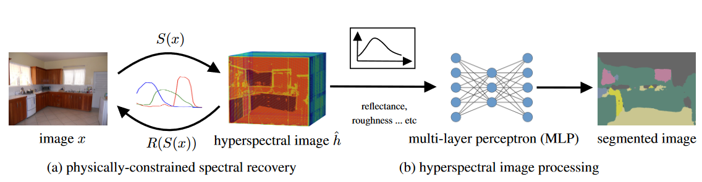
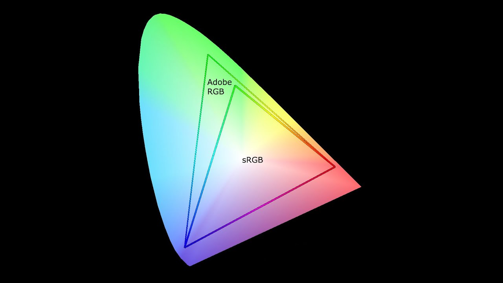
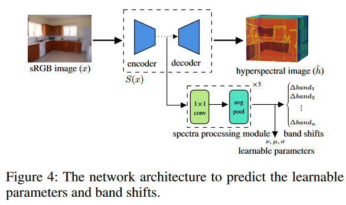
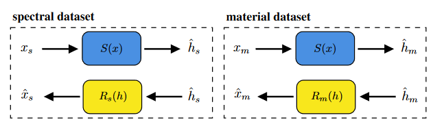
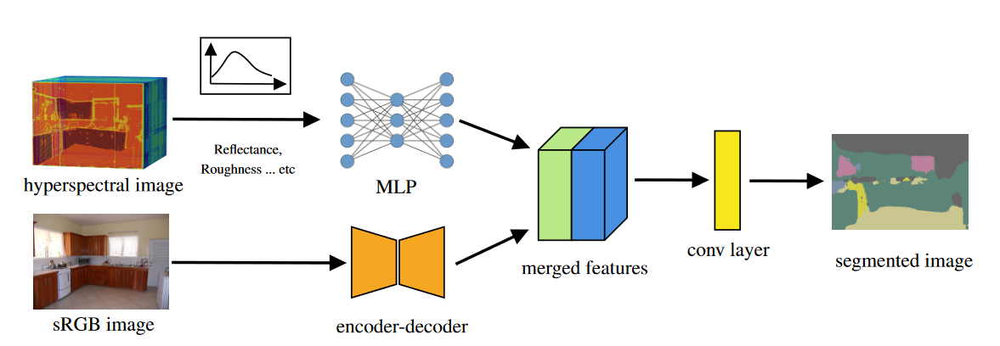
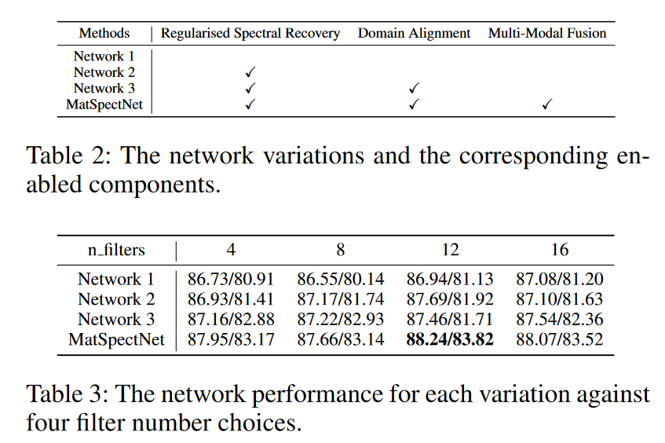

# notas 2023-08-02

paper => https://arxiv.org/pdf/2307.11466.pdf

Material suplementario => https://github.com/heng-yuwen/MatSpectNet/blob/main/supplementary%20material.pdf

codigo => https://github.com/heng-yuwen/MatSpectNet/tree/main

## MatSpectNet: Material Segmentation Network with Domain-Aware and Physically-Constrained Hyperspectral Reconstruction

MatSpecNet => Material Hyperspectral Reconstruction

Objetivo => Reconstruir la imagen hiperspectral a partir de una imagen RGB para asi poder segmentar los materiales de la imagen.

***Segmentacion de materiales***: *identificar la categoria de un material por cada pixel en una imagen dada*

se escogen las imagenes espectral debido a que en teoria la firma espectral de un material es unica.

## MatSpecNet

El modelo end-to-end se compone de 2 partes:

## datasets usados

- ARAD_1K => incluye pares de imagenes rgb y imagenes hiperespectrales

- Material dataset

- SpectralDB

- LMD (test)

- OpenSurfaces (test)

### Physically-Constrained Hyperspectral Reconstruction

el input de la red son imagenes sRGB (standard RGB), ya que estas son las imagenes que se obtienen de las camaras convencionales.

el sRGB es un espacio de color:

- por que se utiliza ese espacio de color? porque si Adobe RGB o ProPhoto RGB son espacios de color mas grandes, por que no usarlos?
- por que no usar la imagen raw como input?
- por que no usar la imagen demosaiceada como input?

*para obtener las imagenes en sRGB la camara aplica ajustes de brillo y correccion de gamma para obtener la imagen final*

---

$x$ $\rightarrow$ imagen sRGB $\quad$ $h$ $\rightarrow$ imagen espectral

- $S(x)$ => red que toma como input la imagen sRGB y genera una imagen espectral
- $R(h)$ => red que toma como input la imagen espectral y genera una imagen sRGB

la razon de $R(h)$ es que evaluar la calidad de la imagen espectral generada por S(x) es dificil debido a la falta de imagenes hiperespectrales medidas, $R(h)$ modela la camara fisica

lo ideal es: $R(S(x)) = x$

**Se define la loss global como:**

$$
\begin{equation}
L_{\text {total }}=10 \times L_{\text {band }}+5 \times\left(L_{\text {rgb }}+L_{\text {spectral }}\right)+0.5 \times L_{\text {domain }}
\end{equation}
$$

Ltrans (que esta implicita en $L_{rgb}$) se dfine como:

$$
l_{trans} = MSE(x, R(S_{\theta}(x)))
$$

Se uso la red MST++ como $S(x)$

$R(h)$ no puede ser una simple red, en este caso se debe incorporar el modelo fisico RGB de la camara, esto se define de la siguiente manera:

$$
R(h) = f_{jpeg}(\mu f_{noise}(W_{rgb}h))
$$

donde $h \in \mathbb{R}^{n\_bands \cdot H \cdot W}$

- W es una matrix que formatea la funcion de respuesta RGB de la camera $W_{rgb} \in \mathbb{R}^{3 \cdot n\_bands}$, esto es especifico para cada camara
- f_noise modela el ruido
- f_jpeg modela la compresion jpeg

la imagen noiseless RGB se modela como: $W_{rgb}h$

para que se puedan manejar imagenes de distintas cameras, se procede a aprender el desplacamiento en cada banda respecto a la respuesta estandar sRgb (que se saca de el dataset ARAD_1K)

para aprender estos desplacamientos, se agrega una rama en el espacio latente del encoder:

#### loss band

se define la siguiente loss:

$$
L_{b a n d}=\sum_{r, g, b} \sum_\lambda b a n d_{\lambda \mid r, g, b} \times\left\|\Delta b a n d_{\lambda \mid r, g, b}\right\|
$$

penaliza los desplazamientos diferentes de 0 (?).

los parametros aprendibles $v, \mu, \sigma$ corresponde a parametros de ruido y se usab para generar la imagen rgb con ruido asi:

$$
r g b_{\text {noisy }}=\mu P\left(\left(N(0, \sigma)+r g b_{\text {clean }}\right) \times \nu\right) / \nu
$$

esto es, la imagen con ruido gaussiano agregado y a esta imagen se pasa por una distribucion de poisson y se divide por el parametro para normalizarm, finalmente se multiplica por por $\mu$ para ajustar la intensidad

una vez obtenida la imagen noisy, se post-procesa con **swin transformer layers**

#### loss rgb

se entrena con dos datasets con ARAD_1K y con el dataset de materiales:

$x_s$ $\rightarrow$ imagen de ARAD $\quad$ $x_m$ $\rightarrow$ imagen de materiales

en el dataset de los materiales no se tiene datos de la imagen hiperespectral

$$
\begin{equation}
\begin{aligned}
L_{r g b} & =L_{trans}+L_{M S E}\left(x_m, \hat{x}_m
\right) \\
& +L_{M S E}\left(x_s, R_s\left(h_s\right)\right)
\end{aligned}
\end{equation}
$$

Ltrans ya se definio arriba, el segundo termino sirve para medir el error entre la imagen sRGB y la imagen sRGB reconstruida a partir de la imagen espectral reconstruida en el dataset de los materiales, el tercer termino es lo mismo para el dataset ARAD

Al parecer se tienes dos redes de transformacion a RGB $R_s(h)$ y $R_m(h)$

#### loss spectral recovery

se define asi:

$$
L_{spectral}=L_{M R A E}\left(h_s, \hat{h}_s\right)+L_{M R A E}\left(h_s, S\left(R_s\left(h_s\right)\right)\right)
$$

se calcula el mean realtive absolute error para la imagen hiperespectral generada.

#### loss domain

para la parte de adaptacion de dominio, se usa el discrimador de PatchAGAN para asegurarse de la indistinguibilidad entre el dataset hiperespectral y el dataset de materiales.

$$\begin{gathered}
L_{domain}=L_{M S E}\left(f_{d- spectral }\left(\hat{h}_m\right), 1\right) \\
+L_{M S E}\left(f_{d-r g b}\left(R_s(h)\right), 1\right)
\end{gathered}$$

#### Material segmentation

se agrega otro encoder-decoder llamado DBAT que extrae caracteristicas de la imagen RGB que luego se concatena con la salida de un perceptron multicapa que genera 128-channel features 

luego esto pasa por una capa convolucional de 3x3 y el resultado es la predicional final de los materiales.

#### interpretable hyperspectral processing y Multi-Modal fusion

primeramente quieren identificar que bandas son las que tienen mas importancia y esto lo hacen implementando self-attention lo que nos da como resultado caracteristicas filtradas de la imagen espectral

por el otro lado, se quiere a;adir informacion de el dataset spectraldb, esto se hace a nivel de pixel, yt se compara con la diferencia de la "spectra shape matrix s of the spectra measurements", busca el registro mas parecido y le agrega daots como reflectance, specularit y roughness

esa parte no la entendi.

el caso es que la salida de esas dos ramas, se concatena y se pasa al perceptron multi capa

### Training

El entrenamietno se divide en tres fases.

1. pre-entrenamiento de $S(x)$
2. Entrenamiento de la physically-constrained recovery network $S(x)$ y $R(h)$. 
3. entrenamiento de el decoder de la segmentacion del material

---

1. La red que se usa es la MST++, se entrena con patches de 128x128 y se hace data augmentation, se entrena con $L_{MRAE}$

https://github.com/caiyuanhao1998/MST-plus-plus

---

2.se carga la red pre-entrenada S(x) Y se procede a entrenar con la loss global

---

3.se procede a entrenar el decoder del material-segmentation, se utilizan patches de 512z512

---

### resultados

como se ve en los resultados, los modulos propuestos no generan una mejora demasiado significativa en las metricas.

## Codigo

El codigo esta incompleto, faltan los archivos de configuracion