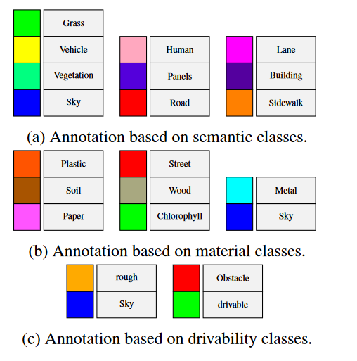
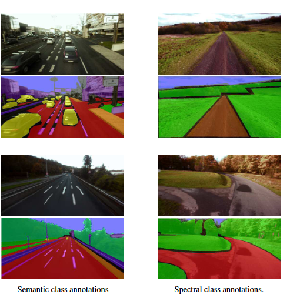
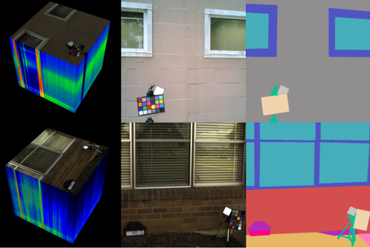
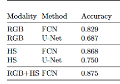
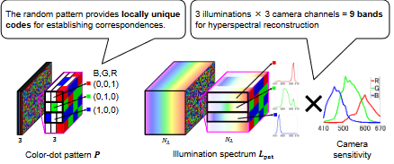
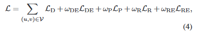
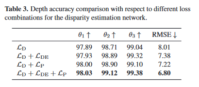
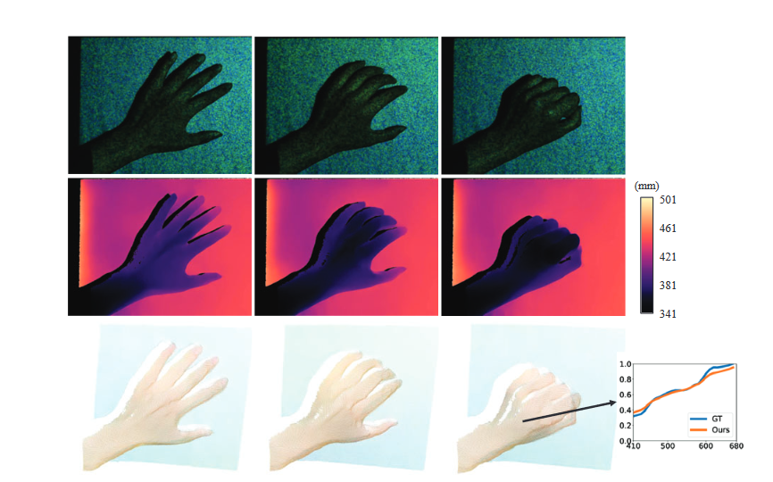

# 2023-08-23

## Paper: Programmable Spectrometry: Per-pixel Material Classification using Learned Spectral Filters

se propone adquirir un conjunto de proyecciones lineales de HSI en vez de adquirir todo HSI para asi reducir el costo computacional de la adquisicion de HSI, el procesado lo realizan opticamente para optener las spectrally-filtered images, lo logran usando una camara con respuestas espectrales programables.

utilizan respuestas espectral filtradas para hacer la clasificacion de los materiales a nivel de pixel.

para lograr una camera con respuestas espectrales arbitrarias de forma rapida, se partio del trabajo agile spectral imager que confia en la codificacion del plano arcoiris para conseguir el filtrado espectral

por tanto en el plano arcoiris, se coloca una apertura codificada, una de sus observaciones es que ese codigo causa spectral blur y spatial blur. Al parecer ese blur es invertible en ambos dominios y asi evitar el uso de una apertura que genere blur.

segun el patron que se coloque se consigue un perfil espectral diferente.

Se evalua para clasificacion binaria con SVM y multi-class con neural networks.

en las redes neuronales la primera capa se modela como el filtro espectral programable, los pesos de esta capa seran los filtros aprendidos discrimiantes.

se extraen esos filtros y se implementan en el plano arcoiris para conseguir la camara programable

encuentran un tradeoff entre el numero de filtros aprendidos y el accuracy.

los filtos espectrales sirven como una transformacion lineal del espectro para capturar las estructuras subyacentes para la tarea especifica de clasificacion

es interesante que como experimento final probaron con medir remotamente los perfiles oxigenados y desoxigenados de la sangre, para mostrar que se pueden medir con menos imagenes que los metodos del estado de larte.

comentan que una de las limitaciones de su modelo es la asuncion de que los pixeles son de una sola clase de materia, mientras en el mundo real muchos ejemplos estan hechos de mezclas de materiales

### Resultados

Consiguen un resultado menos a los del estado del arte, ya que su enfoque solo tiene encuenta la informacion espectral y no la especial, se dice que su metodo les permite capturar menos imagenes que el numero de bandas espectrales.

### dataset

Construyen un dataset propio que recolectaron de objetos tipicos con un espectrometro, para seis clases de materiales:

- fabric, paper, plants, plastic, human skind and wood

los recolectan bajo distintas iluminaciones

**el dataset esta disposnible para descargar**

### preguntas y temas por investigar

- por que esta el tradeoff spacial y espectral al usar diferentes slit?

- como controlan el smothness de los perfiles espectrales mediante el weight decay? cual es la relacion?

- para el caso de la svm que filtros espectrales usan?

- por que no integran la informacion espacial en el modelo?

- como funcion el invertible blur code?

## Paper: MATERIAL SEGMENTATION IN HYPERSPECTRAL IMAGES WITH MINIMAL REGION PERIMETERS

en este paper se propone un algoritmo para la segmentacion de materiales en imagenes hiperespectrales a travez de dos pasos, primero una clasificacion por pixel, y luego un paso de segmentacion a travez de una heuristica

el proceso de clasificacion por pixel se realiza con un SVM , paralelamente se usa SLIC para generar superpixeles en la imagen, luego la heurisitca que se usa es, los pixeles contenidos en cada superpixel votan y la clase con la mayor votacon se asigne a todo el superpixel, asi consiguen areas mucho mas consistentes que las que se consiguen con la clasificacion por pixel.

luego para conseguir bordes mas suaves plantean un problema de optimizacion que no entendi (no lo explican bien (creo) ) 

lo interesante es que para evaluar su metodo proponen un nuevo dataset con labels de materiales a partir de otros datasets existentes de imagenes hiperespectrales, supuestamente estaba disponible pero el link esta caido :( 

## Paper: Hyko: A spectral dataset for scene understanding

su contribucion es presentar un dataset de imagenes hyperespectrales con labels enfocado en trafico urbano y rural

*"hyperspectral image analysis for autonomous navigation is an exciting and promising new application scenario"*

usan un metodo novedoso para capturar las imagenes hyperespectrales, en especifico: snapshot mosaic (SSM) imaging using the Fabry-
Perot principle. para asi superar los inconvenientes de lentitud de adquisicion de imagenes hyperespectrales.

*The data covers wavelengths from 400 to 1000 nm spanning the visible and near infrared spectral ranges.*

presentan tres subconjuntos asi:

HyKo 1: Contains drivability labels.
HyKo 2: Contains drivability, semantic and spectral reflectance labels.

para hyko2 montaron 1 camara hiperespecrtral en vis y otra en el ir, con 2 lidar y un espectrometro

**(tenemos datos del lidar ???)** (supuestamente si, pero tendria que verificarlo descargando el dataset)

los labels se dividen de esta manera:

el link para descargar el dataset esta aqui:
https://hyko-proxy.uni-koblenz.de/hyko-dataset/

y tienen algunos scripts de ejemplo para cargarlo

no especifican el numero de imagenes por ninguna parte, pero yo conte al rededor de 163 cubos espectrales

## Paper: A hysperspectral and RGB dataset for building facade segmentation

en este paper se presenta un dataset de imagenes hyperespectrales con el label de la segmentacion de los materiales asociado

se tienen 9 cateogiras y 44 clases en total

se tienen 513 imagenes hiperespectrales que contienen 204 bandas con dimensiones espaciales de 512 x 512

el dataset es de uso publico

link al dataset: https://data.csiro.au/collection/csiro%3A55630v1
pesa en total 56gb

los autores ademas muestran el rendimiento para la segmentacion de los materiales a partir de la imagen hiperespectral y la imagen rgb usando redes del estado del arte como una u-net o una FCN 

demuestran que combinando rgb y hyperespectral se obtiene mejor rendimiento que usandolas por separado (aunque se ve claramente que la imagen hyperespectral por si sola obtiene mas rendimiento que la rgb y se acerca mucho al obtenido en la fusion de las dos)

## Paper: Deep Hyperspectral-depth reconstruction using single color-dot projection

se propone una nueva forma para medir profundida y reflectancia espectral simultaneamente usando una camara rgb y un proyector

a partir de las mediciones se reconstruye el depth y la reflectancia espectral usando redes convolucionales

este metodo solo funciona para escenas in-door, la camara y el proyector deben estar calibrados, en el proyector se proyecta un codigo de color aleatorio, rojo,verde o azul. y con la camara capturan la imagen I 

**1.)** a partir de I extraen el patron de puntos de color aplicando local contrast normalization (LCN), ese patron se concatena y de ahi se obitene el **disparsity** con una red convolucional

    disparsity :  Any point in the scene that is visible in both cameras will be projected to a pair of image points in the two images, called a conjugate pair. The displacement between the positions of the two points is called the disparity .

*(por que usar la disparsity en vez de el depth map directamente si no es estereo?)*

luego a partir del dispersity map se obtiene el depth map
https://i.stack.imgur.com/VbcCj.jpg

**2.)** luego se reconstruye la imagen hyperespectral con la imagen I, el mapa de profundidad Z y algo llamado warped illumination spectrum L_pat

L_pat se crea para proveer la informacion de iluminacion correcta para cada pixel de la camara (no entendi)

todos esos inputs ingresan a otra red convoluconal que reconstruye la reflectancia

El entrenamiento se realiza de manera supervisada y entrenado las dos redes a la vez, con varias losses como la distancia l2, y losses de bordes

aunque luego nmuestran una tabla donde se ve que esa composicion de losses en realidad no aporta tanto

para el entrenamiento generaro un dataset de hyperspectral-depth con escenas 3d sacadas de shapenet core dataset, como ese dataset solo tiene la escen, asignaron para cada textura una reflectancia espectral aleatoria

en esa escena 3d hacen la respectiva simulacion de todo su pipeline, para asi obtener la imagen I y el groundtruth y entrenar

resultados:

el dataset generado por ellos esta disponible para descargar: https://www.dropbox.com/sh/o8r0sv7vdcitqpd/AAA3TXbXMxdTfBfT1RNbkvBxa?dl=0

#### dudas

- por que usar la disparsity en vez de el depth map directamente si no es estereo?

- que es L_pat?

- como se aseguran que en la imagen tomada un dot o pixel capturado solo contenga un color y no la combinacion de los cercanos?

-  como se aprovechan los codigos de colores para la rescontruccion espectral? cual es la intuicion?