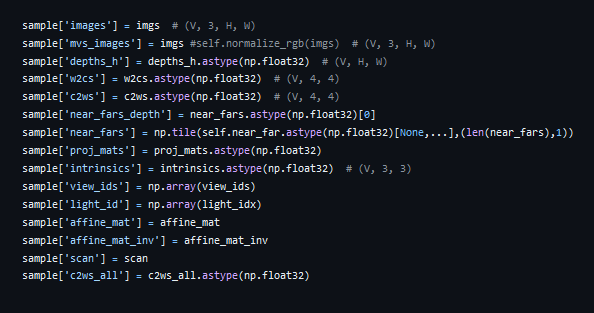
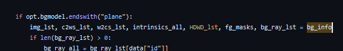
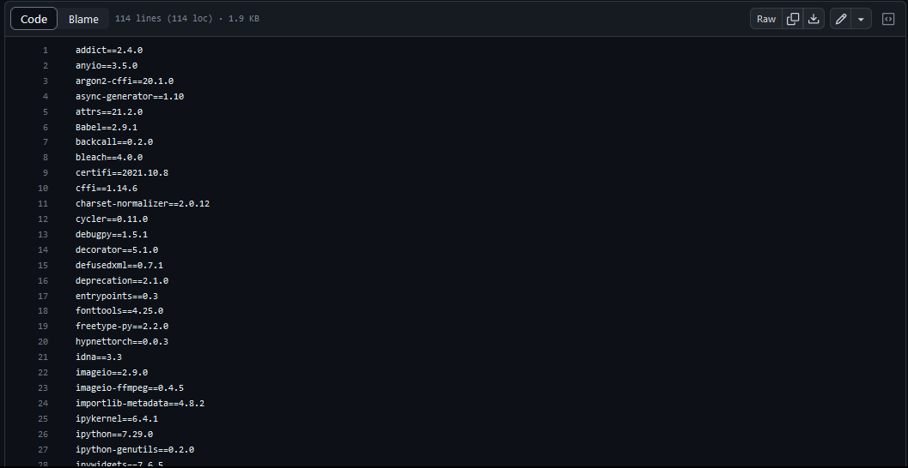

# 2023-12-1

## paper: Point-NeRF: Point-based Neural Radiance Fields

EXPLICACION PAPER HERE

### codigo

el paper tiene un repostiorio de github en el cual tiene todo el codigo, este se encuentra en:
https://github.com/Xharlie/pointnerf

en el readme del repo dan una explicacion muy naive de como ejecutar el pipeline de entrenamiento y testeo

se revisaron los dataloader, pero son demasiado complejos y muy especificos para el dataset
por ejemplo para el dataset DTU se encontro que cada sample en un batch contiene todas estas variables:

por otro lado, para el train, al parecer tienen codigo especifico dependiendo del sample que se este tratando, lo que dificula la implementacion de un dataloader generico

en conclusion, encontramos que el codigo es demasiado laberintico.

Por esta razon decidimos buscar otro trabajo del estado del arte que hiciera la misma tarea:

encontramos este otro trabajo, llamado: https://github.com/gmum/points2nerf

## paper: Points2NeRF: Generating Neural Radiance Fields from 3D point cloud

EXPLICACION PAPER HERE

### codigo

el codigo del paper es mucho mas simple que el anterior, hay problemas con las librerias ya que son demasiadas:

intentamos hacer el test con el mismo dataset que usaron ellos, pero el codigo da error, lo que imposiblita su ejecucion.

El error que se nos presentaba era al intentar evaluar sobre los datos que ellos mismos tenian y que subian a un drive.
Al realizar la carga con el archivo defaul llamado "chair" e ejecutaba con parametros pres esatblecidos para la red 

Tambien se realiza la construccion de el modelo y la separacion de os datos de entrenamiento( Para este caso las vistas)

Sin embargo despues de la creacion respectiva de el modelo y de la carga de datos, el codigo nos arroja el siguiente error, que se mantiene en un bucle, el cual no deja permite la ejecucion de la inferencia y la visualizacion de el renderizado.

