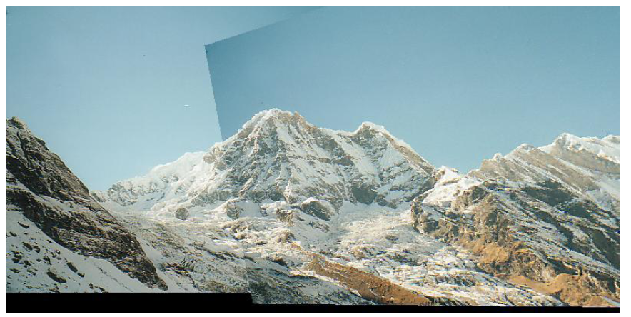
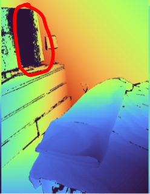
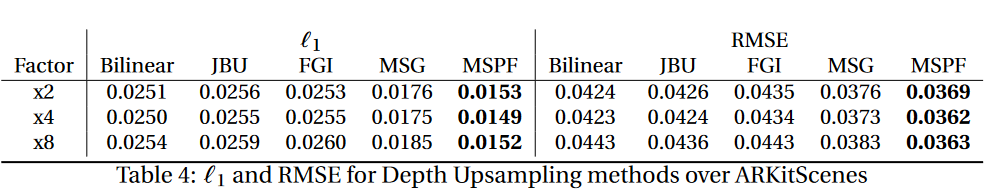
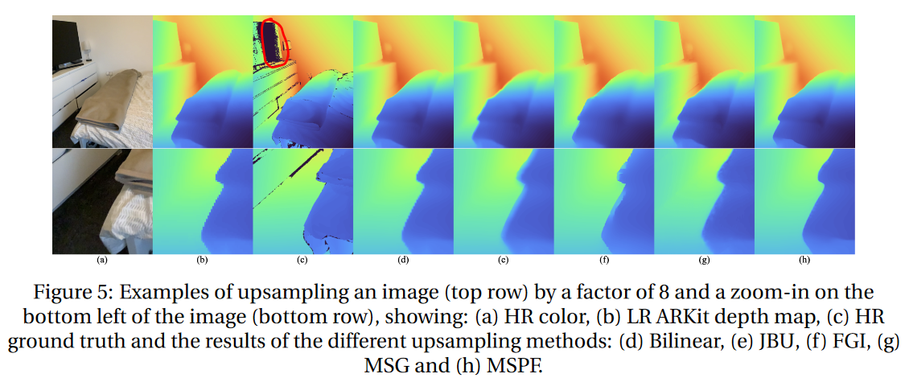
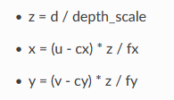

# 2023-10-23

##  Investigate existing methods and algorithms for rgb depth alignment.

### **Paper: ARKitScenes: A divserse Real-World Dataset For 3D Indoor Scene Understanding Using Mobile RGB-D Data**

el paper propone un dataset de 3d indoor scenes, con 3d mesh, depth, rgb, y 3d object detection a partir de capturas con un ipad pro con el sensor de LIDAR

son 450k frames HR, 5047 scans

adquisicion de datos raw = IMU, RGB(wide and ultra wide), sensor lidar denso y laser faro foucs S70 recolectando XYZRGB point cloud

- 19920x1440 laser scanner
- 256x192 ARKit depth

Primero se usa el faro focus, tomando 4 ecaneos por sala, luego se usa el ipad grabando tres videos intentando capturas todas las superficies de la sala, cada video sigue un patron diferente de movimiento

para la reconstruccion de la escena, usan el arkit scene reconstrucition, de aqui construyen su propia app

*since data collection of a venue takes an average of six hours and many venues are lit by sunlight, the lighting situation can change during that time resulting in potentially inconsistent illumination between the different sequences and scans*

se hacen dos tareas 3d object detection y color-guided 3d alignment

Ground truth poses and depth maps:
en un one-time offline step, llevarlon el point cloud de el laser a un sistema de coordenadas comun que automaticamente estima el  [**6DoF rigid body**](https://www.wikiwand.com/en/Six_degrees_of_freedom) transformation para cada escaneo

cada point cloud se recude a 3 dimensiones usando [stereographic projection](https://www.wikiwand.com/en/Stereographic_projection) y se computa la [2D Delaunay triangulation](https://www.wikiwand.com/en/Delaunay_triangulation), luego de hacer esto se aplica al point cloud la triangulacion y se obtiene una malla 3d watertight a la que le computan las coordenadas de las texturas [?](https://coeleveld.com/spherical-equirectangular-environment-textures-and-hdri/)

*watertight meshes usually describe meshes consisting of one closed surface.*

luego se computan las coordenadas de las texturas a partir de una textura equirectangular, la textura es el color rgb extraido de el point cloud [?](https://coeleveld.com/spherical-equirectangular-environment-textures-and-hdri/)

luego para cada triangulo se computa la el vector de la normal [1](https://www.scratchapixel.com/lessons/3d-basic-rendering/introduction-to-shading/shading-normals.html)  

y el vector del rayo desde el centro del triangulo al punto nodal del escanner. Con esto se define un threshold del que si el angulo lo excede se manifiesta una discontinuidad y va a ser usado como occlusion geometry, y si no como foreground geometry. Esa separacion permite razonar sobre unobstructed line-of-sight

los dos conjuntos de triangulos se renderiszas de forma separada con OpenGL. Segun los renderizados forman una mascara con el depth y stencil buffer. [3](https://open.gl/depthstencils) [4](https://www.youtube.com/watch?v=wVcWOghETFw)

esto se hace de forma separa y se renderizada para cada escaneo, luego se hace merge de los renderizados.

el siguiente objetivo es determinar la 6DoF pose del ipad respecto al sistema de coordenadas de el lugar. 

para esto extraen  local image features y descriptors. y lueog se hace match entre features (query features y reference feature)

ya cuando se ha hecho el match se usa RANSAC y [PnP](https://www.wikiwand.com/en/Perspective-n-Point) para estimar la pose del ipad [?](https://medium.com/@ajithraj_gangadharan/3d-ransac-algorithm-for-lidar-pcd-segmentation-315d2a51351)

cuando ya esto se ha determiando, se renderiza un frame alineado para asi generar el ground truth depth map que codifica el depth con una orthographic [projection](https://www.wikiwand.com/en/Orthographic_projection)

finalmente asi obtienen el ground truth del depth a una HR

## *Color-Guided depth upsampling*

Critican los metodos tradicionales de LR to HR ya que no tienen en cuenta los artifacts de LR

usan Multi-Scale Guided Networks (MSG) para compararlo con los approaches clasicos 

Para su caso especifico la oclusion de algunas escenas puede casar que algunas partes del depth no tenga informacion en el ground-truth por tanto no se pueden usar las metricas tipicas

para entrenar removieron los que tenian mas del 40% de pixels sin informacion en el ground truth y utilizaron metricas custom para la loss

resultados obtenidos:

obtienen mejores resultados, pero nada sorprendente

resultados visuales:

#### preguntas:

what's the intuition behind dividing into occlusion geometry and foreground geometry for the rendering?

### rerun

<video width="630" height="300" src="rerun.mp4"></video>

### scene reconstruction apple

https://developer.apple.com/documentation/arkit/arworldtrackingconfiguration/3521376-scenereconstruction

https://developer.apple.com/documentation/realitykit/realitykit-scene-understanding

https://www.youtube.com/watch?v=6JMYkHC69OA

https://developer.apple.com/videos/play/tech-talks/609/

just for objects: https://developer.apple.com/augmented-reality/object-capture/

# interesting

https://www.sciencedirect.com/science/article/pii/S2666225623000040

# intrinsic matrix

https://developer.apple.com/documentation/avfoundation/avcameracalibrationdata/2881135-intrinsicmatrix

los valores en xyz en el point cloud se calculan con los valores en la matriz

